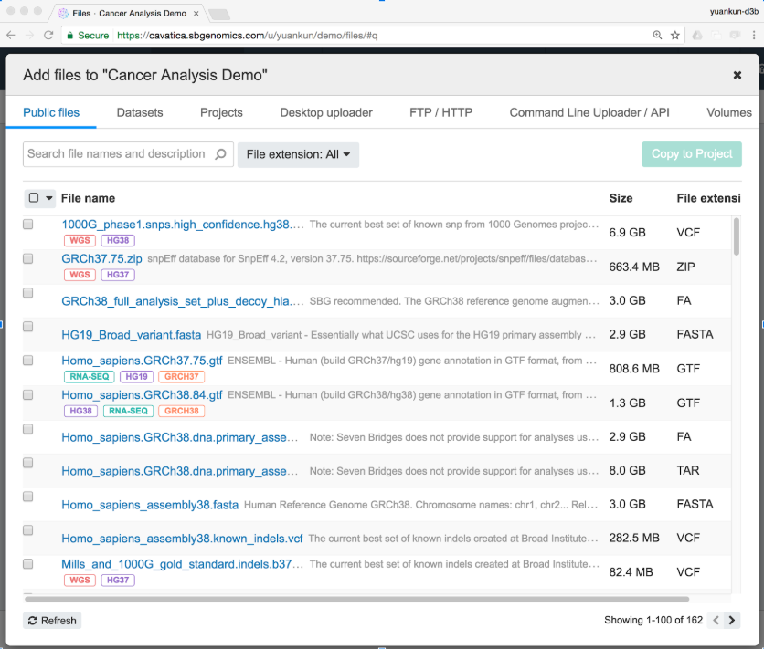

# Day4 CWL & CAVATICA

[Slides](../slides/day4/day4.md)

## Task 1, setup your own project
- create a new project
- copy test workflow to the project
	- [Whole Exome Analysis - BWA + GATK 2.3.9-Lite](https://cavatica.sbgenomics.com/public/apps#admin/sbg-public-data/whole-exome-sequencing-gatk-2-3-9-lite/)
- copy test fastq to the project
	- [example_human_Illumina.pe_1.fastq](https://cavatica.sbgenomics.com/u/yuankun/bfx-lessons-2019/files/#q)
	- [example_human_Illumina.pe_2.fastq](https://cavatica.sbgenomics.com/u/yuankun/bfx-lessons-2019/files/#q)
- run the task

## Task 2, upload data
### GUI add files


### CLI/API
**Preparation:** [Get you developer token](http://docs.cavatica.org/docs/get-your-authentication-token)

**Installation Seven Bridges CLI**
- For Mac/Linux
```bash
$(cwl-env) curl https://igor.sbgenomics.com/downloads/sb/install.sh -sSf | sudo sh
```
- For Windows: https://docs.sevenbridges.com/docs/command-line-interface#section-windows-installation

**Configuration**
```bash
$(cwl-env) sb configure
Seven Bridges API endpoint: https://cavatica-api.sbgenomics.com/v2
Seven Bridges authorization token: **************** {your token}
```

**Overall usage**
```
$ sb
A command-line client for the Seven Bridges Platform

Usage:
  sb [command]

Available Commands:
  apps        Manage apps on the Platform.
  billing     Obtain information about available billing groups.
  configure   Configure credentials to access your project on the Platform.
  download    Initiate file download.
  exports     Manage exports on the Platform.
  files       Manage files on the Platform.
  imports     Manage imports on the Platform.
  members     Manage project members on the Platform.
  projects    Manage projects on the Platform.
  tasks       Manage tasks on the Platform.
  upload      Upload a file.
  version     Display the version of application currently used.
  volumes     Manage volumes on the Platform.
  whoami      Display information about the current user.

Flags:
      --config string    Configuration file to use instead of the default one.
      --debug            Run the command with debug information in the output.
      --dryrun           Display output of a command without running it.
  -h, --help             help for sb
      --no-color         Turn on/off the color of the output.
      --output string    The formatting style for command output ("text", "json", "table"). (default "text")
      --profile string   Configuration profile to use from credentials file. (default "default")
      --quiet            Suppress chatty console output.

Use "sb help [command]" for more information about a command.
```

**Upload file**
```bash
Usage:
  sb upload --file <file_value> --project <project_value> [--name <name_value>] [--overwrite] [flags]

## example
## jq: https://github.com/stedolan/jq
$ sb upload --file header.txt --project yuankun/demo --output json | jq
{
  "id": "5cb07db5e4b07ea21e2cc480",
  "name": "header.txt",
  "project": "yuankun/demo",
  "created_on": "2019-04-12T11:59:49Z",
  "modified_on": "2019-04-12T11:59:49Z",
  "type": "file",
  "parent": "",
  "size": 5301,
  "metadata": null,
  "tags": null,
  "origin": {},
  "storage": {
    "type": ""
  }
}
```

**[API endpoints](http://docs.cavatica.org/v1.0/docs/initialize-a-multipart-upload)**

## Task 3 - API example review
- ipython notebooks
	- [cavatica-python-api.ipynb](../slides/day4/examples/cavatica-python-api.ipynb)
	- [kf-pilot-dataframe.ipynb](../slides/day4/examples/kf-pilot-dataframe.ipynb)
- scripts
	- [draft alignment task](../slides/day4/scripts/alignment-task-draft.py) with [references](../slides/day4/scripts/alignment-task-reference-input.yaml)
	- [import local cwl to cavatica](../slides/day4/scripts/import-cwl.py)

[Slides](../slides/day4/day4.md)