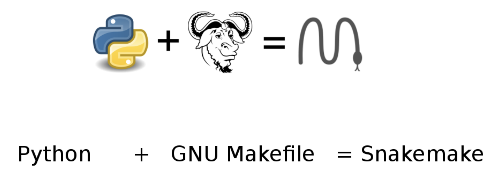
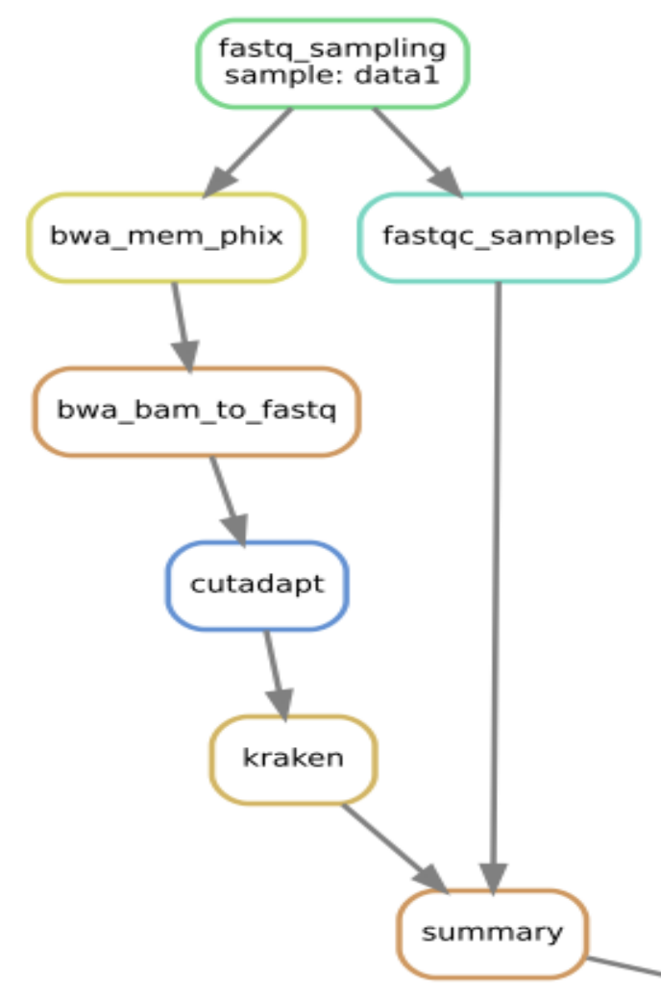
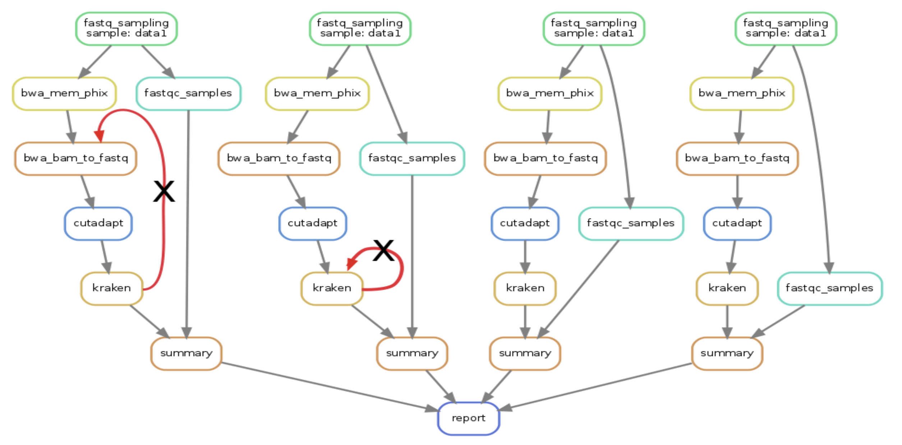

# Last time
* Containers enable repeatable tool usage easy installations
* Build containers with Dockerfiles
* Automate builds with quay and dockerhub
* One tool per container

---

# Day 2 snakemake



---

## Workflow manager



---

## Parallel workflow 


 
---

## Aside - anaconda and miniconda 
* Data science package manager 
* Create enviroments with bioinformatics tools
* Share environments with requirements file 
* Not as robust as containers 

---

## conda
```
conda create -n env-name python=3.7
source activate env-name
conda install pandas
conda install -c bioconda bedtools
conda env export > env.yaml
source deacivate
```

---

## Task 1: install snakemake with anaconda
* [https://github.com/samesense/bfx-lessons-2019/blob/master/lessons/day2.md#task-1](https://github.com/samesense/bfx-lessons-2019/blob/master/lessons/day2.md#task-1)

---

## Why workflow manager?
* Automatic task parallelization
* Automatic dependency checking
* Resume failed workflows 
* Record all steps in one file
---

## Why snakemake?
* Large community support
* Works on respublica, laptop, cloud
* Python syntax
* Container and conda env support
* Remote file support
* Dryrun

---

## What's it look like? 
* It's just a Python (3) script 
* A set of rules (input / output / shell or run) 
* Snakemake computes dependencies 

```
rule wordcount_isles: 
    input: "moby-dick.txt" 
    output: "moby-wordcount.txt" 
    shell: "wc -w {input} > {output}
```

---

## Example: mapping reads 

```
rule bwa_map: 
    input: "data/genome.fa", "data/samples/{sample}.fastq" 
    output: "mapped_reads/{sample}.bam" 
    shell: "bwa mem {input} | samtools view -Sb - > {output}"
    
rule samtools_sort: 
    input: "mapped_reads/{sample}.bam" 
    output: "sorted_reads/{sample}.bam" 
    shell: 
        "samtools sort -T sorted_reads/{wildcards.sample} "
        "-O bam {input} > {output}" 
    
rule samtools_index: 
    input: "sorted_reads/{sample}.bam" 
    output: "sorted_reads/{sample}.bam.bai" 
    shell: "samtools index {input}"
   
SS = ('s1', 's2', 's3')
rule all:
    input:
        expand("sorted_reads/{sample}.bam.bai", sample=SS)

# snakemake -s Snakefile -j3 all
```

---

## script & keyword arguments 
```
rule rewrite_files: 
    input: "path/to/infile", "path/to/other/infile" 
    output: 
        first="path/to/outfile", 
        second="path/to/other/outfile" 
    run: 
        # write to both outfiles 
        for f in input: 
            ... 
        with open (output.first, "w") as out: 
            out.write (...) 
        with open (output.second, "w") as out: 
            out.write (...)
```

---


## containers 
```
rule fq_to_fa:
    input:
        SEQ_DIR + '{sample}.fastq.gz'
    output:
        DATA + 'interim/fa/{sample}.fasta'
    singularity:
        "docker://petadimensionlab/docker_16s_vsearch"
    shell:
        'vsearch --fastq_filter {input} -fastaout {output}'
```

```
module load singularity
snakemake --use-singularity \
--singularity-args "-B /mnt/isilon/:/mnt/isilon/" \
-s src/rules/Snakefile_sh.py just_dreg
```

---

## logs and threads 
```
rule merge_pairs:
    input:
        fa1 = SEQ_DIR + '{sample}_1.fastq.gz',
    output:
        DATA + 'interim/fa_merge/{sample}.maxDiffs{md}.olen{over}.mergeLen{mlen}.fa'
    threads:
        5
    log:
        LOG + "merge/{sample}.maxDiffs{md}.olen{over}.mergeLen{mlen}"
    shell:
        "vsearch --fastq_mergepairs {input.fa1} --fastaout {output} "
        "--threads {threads} --fastq_allowmergestagger "
        "--fastq_maxdiffs {wildcards.md} "
        "--fastq_minovlen {wildcards.over} --fastq_minmergelen {wildcards.mlen}"
```

---

## wildcards with expand
```
rule combine:
    input:
        expand(DATA + '{sample}.{{peak_type}}.txt',
               sample=SAMPLES)
    output:
        DATA + 'combined.{peak_type}.txt'
```

---

# Snakemake on respublica
* threads means node count
* off cluster threads means cpu cores
* fix failed runs
* `snakemake --unlock`

```
snakemake -s Snakefile --latency-wait 20  \
-p -j 2 \
-c "qsub -cwd -V -l h_vmem=1G -l mem_free=1G -l m_mem_free=1G"
```

---

## cluster configs
* [cluster config](https://github.com/samesense/run-proseq/blob/82e59b98c154d54deee4e0ea6ccbbff1ea7113e4/configs/cluster.yaml)

```
limit_to_pairs: 
  h_vmem: 85G
  mem_free: 85G
  m_mem_free: 85G
  threads: 1
```

```
limit_to_pairs: 
  h_vmem: 42G
  mem_free: 42G
  m_mem_free: 42G
  threads: 2
```
  
```
snakemake -c  "qsub -V cwd -l h_vmem={cluster.h_vmem} \
-l mem_free={cluster.mem_free} \
-l m_mem_free={cluster.m_mem_free} -pe smp {threads}" \
-k -j 500 --latency-wait 90 --greediness 0.8 \
--cluster-config configs/cluster.yaml \
-s src/rules/Snakefile_sh.py just_dreg
```

---

## Task 2: simple snakefile 
* [https://github.com/samesense/bfx-lessons-2019/blob/master/lessons/day2.md#task-2](https://github.com/samesense/bfx-lessons-2019/blob/master/lessons/day2.md#task-2)

---

## conda environments 
```
rule mk_dm6_gtf:
    input:
       DATA + 'interim/tmp/cruz_init_{genome}'
    output:
       DATA + 'interim/{genome}.gtf'
    conda:
       CONDAS + "cruzdb.env"
    shell:
       "python {SCRIPTS}build_gtf.py {wildcards.genome} {output}"
```

---

## conda environments
* `conda env export > cruzdb.env`
* [cruzdb env](https://github.com/samesense/run-proseq/blob/master/condas/cruzdb.env)

```
snakemake --use-conda -s src/rules/Snakefile_sh.py just_dreg
```

---

## function inputs
```
def mk_rep_cor_bws(wc):
    if wc.tf == 'Brd4':
        samples = [x for x in file_names if 'Brd4' in x[1] and wc.run in x[1]]
    elif wc.tf == 'Pol2ser2':
        samples = [('single', x) for x in pols if 'rep' + wc.run in NAMES[x]]
    return [DATA + 'interim/%s.bw' % (sample,)
            for sample in samples]
           
def mk_cor_rep_bed_input(wc):
    if wc.tf in ('Brd4', 'Flag'):
        return DATA + 'interim/simplePeak_%s_%s_%sip_mergecontrol_wrongsort/%s_0hr__%s.INPUT.bed' % (wc.peak_type, wc.q, wc.bam_ip, wc.tf, wc.run)
    else:
        return DATA + 'interim/simplePeak_%s_%s_%sip_mergecontrol_wrongsort/%s.INPUT.bed' % (wc.peak_type, wc.q, wc.bam_ip, sample,)
        
rule cor_mat_replicates:
    input:   bws = mk_rep_cor_bws,
             bed = mk_cor_rep_bed_input
    output:  dat = DATA + 'interim/rep_plot_table_cor_dat/cor_counts/{tf}.{peak_type}_{q}__{run}__{bam_ip}.npz',
             raw = DATA + 'interim/rep_plot_table_cor_dat/raw/{tf}.{peak_type}_{q}__{run}__{bam_ip}.npz'
    threads: 16
    shell:
        "multiBigwigSummary BED-file "
        "--bwfiles {input.bws} --BED {input.bed} "
        "-p {threads} -out {output.dat} "
        "--outRawCounts {output.raw}"
```

---

## restrict outputs
```
rule rule_name:
    input: DATA + 'raw/{wild}.stuff'
    output: DATA + 'dir/{wild,this|that}.stuff'
    
rule rule_name2:
    input: DATA + 'raw/{wild}.stuff'
    output: DATA + 'dir/{wild,which|where}.stuff'
```

---

## html remote files 
```
from snakemake.remote.HTTP import RemoteProvider as HTTPRemoteProvider
HTTP = HTTPRemoteProvider()

rule all:
    input:
        HTTP.remote("www.example.com/path/to/document.pdf") 
    output:
        'data/raw/remote_file'
    shell:
        "mv {input} {output}"
        
rule all_pass:
    input:
        HTTP.remote("example.com/interactive.php", 
        username="myusername", password="mypassword")        
``` 

---

## ftp remote files 
```
from snakemake.remote.FTP import RemoteProvider as FTPRemoteProvider

FTP = FTPRemoteProvider(username="myusername", password="mypassword")

rule all:
    input:
        FTP.remote("example.com/rel/path/to/file.tar.gz")
    output:
        'data/raw/remote_file'
    shell:
        "mv {input} {output}"
``` 

---


## dropbox files
```
from snakemake.remote.dropbox import RemoteProvider as DropboxRemoteProvider
DBox = DropboxRemoteProvider(oauth2_access_token="mytoken")

rule dl_dropbox:
    input:
        DBox.remote("path/to/input.txt")
        
rule upload_to_dropbox:
    input:  
        i = DATA + 'interim/boundary_annotated_anchors/{loop}'
    output: DBox.remote(DB + "plots/boundaries/{loop}.pdf")
    run:
        df = pd.read_csv(input.i, sep='\t')
        ...
```

---

## box files
```
rule upload_active:
    input:  WORK + 'active_test/active_xls/{exp}.xls'
    output: LOG + 'boxUpload/{exp}.active'
    run:
        shell('curl -u {USR}:{PASS} -T {input} 
        "https://dav.box.com/dav/Proseq_BlobelJing/novo_active/{wildcards.exp}.xls"')
        shell('touch {output}')
        
rule dl_box:
    output: DATA + 'raw/bam/{id}.mm9.bam'
    run:
        box_dir = SAMPLE_TO_FOLDER[int(wildcards.id)]
        shell("""curl -u {USR}:{PASS} 
        "https://dav.box.com/dav/BlobelLab/{box_dir}/{wildcards.id}.mm9.bam" 
        > {output}""")
```

---

## configs
* [config run-local-sh](https://github.com/samesense/run-proseq/blob/master/configs/run-local-sh.json)

```
rule all_trim:
    input: 
        expand(DATA + 'interim/flexbart_pe/{name}.{pair}.fq', 
               name=config['SAMPLES'], pair=(1,2))
```

```
snakemake --configfile configs/run-local-sh.json \
-s src/rules/Snakefile_sh.py just_dreg
```

---

## awk and temp files
```
rule mk_bed_base:
    input:  DATA + "processed/mm9/{aligner}_pe_mouse_r1/{name}.sort.bam",
    output: temp(DATA + 'interim/mm9/{aligner}_bed_base/{name}.bed.gz')
    shell:
          """
          bedtools bamtobed -i {input} | awk 'BEGIN{{OFS="\t"}} ($5 > 0){{print $0}}' | \
          awk 'BEGIN{{OFS="\t"}} ($6 == "+") {{print $1,$2,$2+1,$4,$5,$6}}; ($6 == "-") {{print $1,$3-1,$3,$4,$5,$6}}' | \
          gzip > {output}
          """
```

---

## Task 3: containers and envs 
* [https://github.com/samesense/bfx-lessons-2019/blob/master/lessons/day2.md#task-3](https://github.com/samesense/bfx-lessons-2019/blob/master/lessons/day2.md#task-3)

---

* Next time: jupyter notebooks, github, cookiecutter, ref dir 
* Comments [https://github.com/samesense/bfx-lessons-2019/issues](https://github.com/samesense/bfx-lessons-2019/issues)
