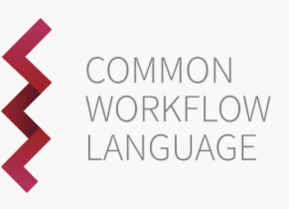
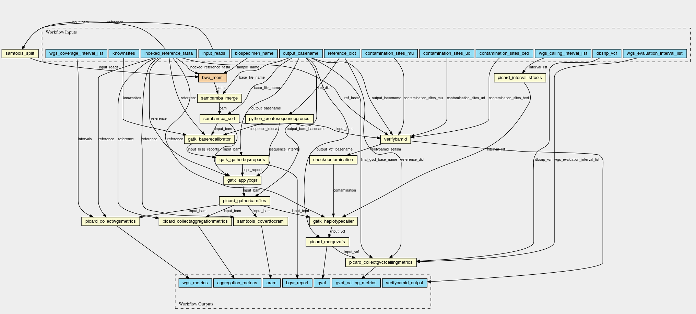
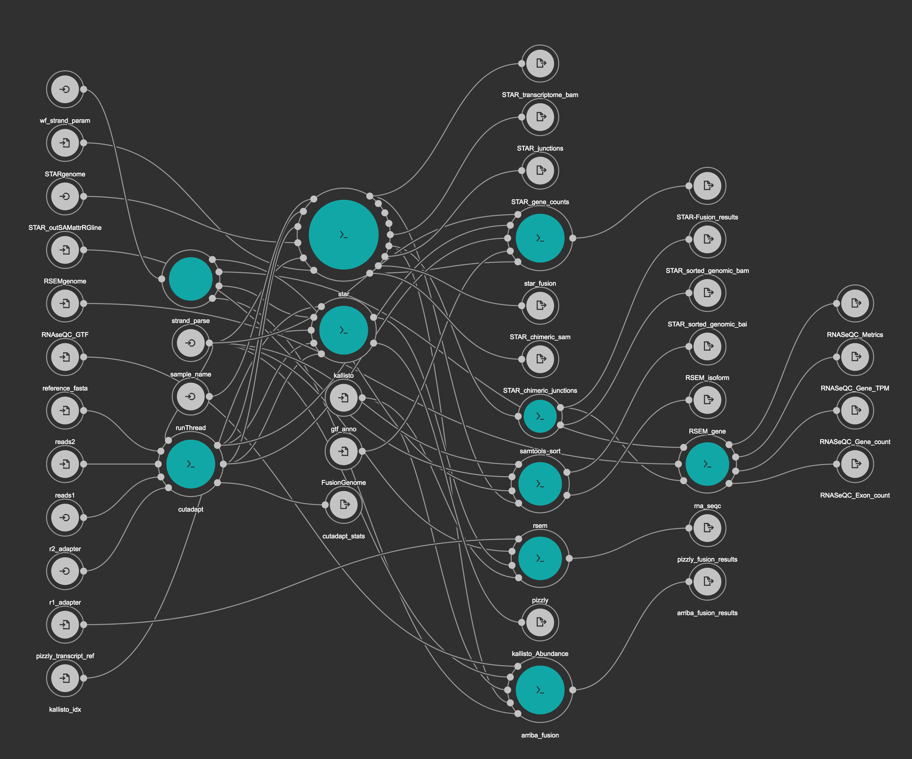
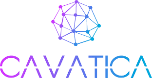

# Day4 CWL & CAVATICA

## CWL/Common Workflow Language

### What is CWL
The Common Workflow Language (CWL) is a specification for describing analysis workflows and tools in a way that makes them portable and scalable across a variety of software and hardware environments, from workstations to cluster, cloud, and high performance computing (HPC) environments.

### Why CWL
- Large community support
	- https://www.commonwl.org/
	- 10+ executors
	- 80+ participating organizations and individuals
	- 300 ppl on cwl [gitter.im](https://gitter.im/common-workflow-language/common-workflow-language)
- Adapted by large data commons
	- [GDC](https://portal.gdc.cancer.gov/): https://github.com/NCI-GDC/gdc-dnaseq-cwl
	- [ICGC-PCAWG](https://docs.icgc.org/pcawg/): https://github.com/ICGC-TCGA-PanCancer/dkfz_dockered_workflows
	- [GA4GH](https://www.ga4gh.org/): [Task](https://github.com/ga4gh/task-execution-schemas/) and [Workflow](https://github.com/ga4gh/workflow-execution-schemas) Working Group:
	- UCSC-CGL: https://github.com/BD2KGenomics/toil-rnaseq
	- KFDRC: https://github.com/kids-first/kf-alignment-workflow
- Cavatica runs CWL :-)

### How does it look like in code
CWL documents are written in JSON or YAML, or a mix of the two.

- Base components
	- Required:
		- `cwlVersion`: https://www.commonwl.org/v1.0/CommandLineTool.html#CWLVersion
		- `class`: `CommandLineTool` | `ExpressionTool` | `Workflow`
	- Optional:
		- `requirements`
		- `hints`
		- https://www.commonwl.org/v1.0/CommandLineTool.html#Requirements_and_hints

- Base template
```
cwlVersion: {draft2, v1.0, etc.}
class: {CommandLineTool, ExpressionTool, Workflow}
requirements: {
  - class: ScatterFeatureRequirement
  - class: MultipleInputFeatureRequirement
  - class: SubworkflowFeatureRequirement
  - class: DockerRequirement
  - class: InlineJavascriptRequirement
  - class: ResourceRequirement
  ... }
hints:
  - {class: 'sbg:AWSInstanceType',              value: c4.8xlarge;ebs-gp2;400}
  - {class: 'sbg:GoogleInstanceType',           value: n1-standard-32;pd-ssd;4096}
  - {class: 'sbg:maxNumberOfParallelInstances', value: 4}
``` 

- `CommandLineTool` template
```
{base}

baseCommand: echo
inputs:
  message:
    type: string
    inputBinding:
      position: 1
outputs: []
```
- `Workflow` template
```
{base}

inputs:
  input1: File
  input2: string

outputs:
  output:
    type: File
    outputSource: step2/output

steps:
  step1:
    run: step1.cwl
    in:
      step1_in1: input1
      step1_in2: input2
    out: [output]

  step2:
    run: step2.cwl
    in:
      step2_in: step1/output
    out: [output]
```

### How does it look like in graph
- [CWLviewer](https://view.commonwl.org/workflows)
	- Kids First DRC Alignment Workflow 
- [Rabix Composer](https://github.com/rabix/composer)
	- Kids First DRC RNA-Seq Workflow 


### [CWL Exercise](../../lessons/day4-cwl.md) 

## Cavatica

### What is Cavatica, and why
- data analysis and sharing platform
- scalable, cloud-based compute environment with 1000 VMs/12K Cores
- provide NIH-Trusted Partner data access
- host [370+](https://cavatica.sbgenomics.com/public/apps) public tools/workflows
- host 20,000 WGS and 1500 RNA-Seq for pediatric cancer and birth defects data
- CWL friendly, easy to import/edit/export
- RESTful API endpoints for all actives
- Interactive analysis: GenomeBowser/JupterLab/RStudio 

### Quick Demo
[Goolge Slides](https://docs.google.com/presentation/d/1934atCus2W4qbrMtxg5mnIUkRT6Lo7xB3G6wRqr9md0/edit?usp=sharing)

### [Cavatica Exercise](../../lessons/day4-cavatica.md) 

## Some Links
- kfdrc alignment workflow: https://github.com/kids-first/kf-alignment-workflow
- kfdrc rna-seq workflow: https://github.com/kids-first/kf-rnaseq-workflow
- kfdrc somatic worklfow: https://github.com/kids-first/kf-somatic-workflow
- dockerfiles from d3b: https://github.com/d3b-center/bixtools
- kfdrc dockerhub: https://hub.docker.com/u/kfdrc

