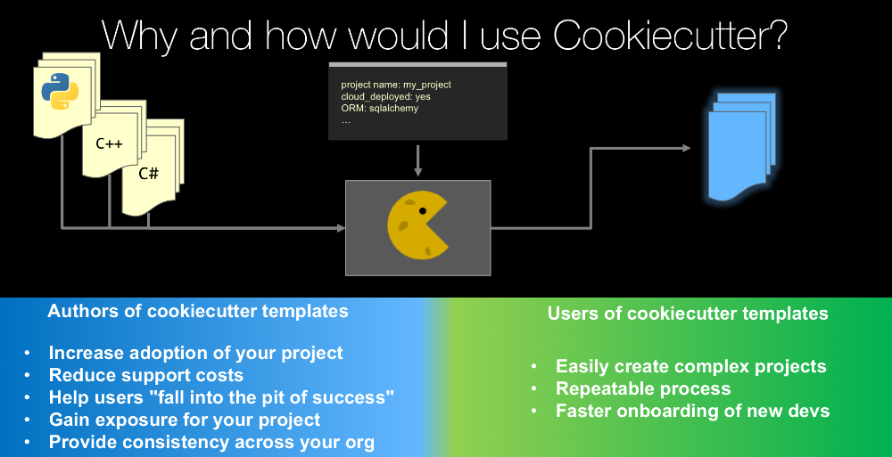

# Cookiecutter 



---

## Outline
* Demo
* Background
* CHOP templates
* Install cookiecutter
* Test CHOP templates
* Cookiecutter syntax
* Modify cookiecutter files
* Considerations
* Other examples

---

## Demo
* https://github.com/samesense/project-template

---

## Background 
* http://drivendata.github.io/cookiecutter-data-science/ since June 2017
* Faster recall of results during meeting data discussions
* [Easy project constant initialization](https://github.com/samesense/project-cookiecutter/blob/master/%7B%7B%20cookiecutter.repo_name%20%7D%7D/src/rules/const.py)
* [Encourages best practices](https://github.com/samesense/project-template/blob/master/%7B%7B%20cookiecutter.repo_name%20%7D%7D/reports/log.md)
* [No messing with gitignore](https://github.com/samesense/project-cookiecutter/blob/master/%7B%7B%20cookiecutter.repo_name%20%7D%7D/.gitignore)

---

## CHOP templates
* https://github.com/samesense/project-template
* https://github.com/samesense/drive-template 

---

## installation
* [https://github.com/samesense/bfx-lessons-2019/blob/master/lessons/ll.md#task-1](https://github.com/samesense/bfx-lessons-2019/blob/master/lessons/ll.md#task-1)

---

## conda
```
conda create -n env-name python=3.7
source activate env-name
conda install pandas
conda install -c bioconda bedtools
conda env export > env.yaml
source deactivate
```

---

## try chop templates
* [https://github.com/samesense/bfx-lessons-2019/blob/master/lessons/ll.md#task-2](https://github.com/samesense/bfx-lessons-2019/blob/master/lessons/ll.md#task-2)

### templates
* https://github.com/samesense/project-template
* https://github.com/samesense/drive-template 

---

## project variable syntax 
https://github.com/samesense/project-cookiecutter/blob/master/cookiecutter.json

```
{
    "project_name": "project_name",
    "repo_name": "{{ cookiecutter.project_name.lower().replace(' ', '_') }}",
    "author_name": "Your name (or your organization/company/team)",
    "description": "A short description of the project.",
    "open_source_license": ["MIT", "BSD", "Not open source"],
    "python_interpreter": ["python", "python3"]
}
```

---

## variable usage
* https://github.com/samesense/project-cookiecutter/tree/master/%7B%7B%20cookiecutter.repo_name%20%7D%7D

---

## task 3: modify template
* [https://github.com/samesense/bfx-lessons-2019/blob/master/lessons/ll.md#task-3](https://github.com/samesense/bfx-lessons-2019/blob/master/lessons/ll.md#task-3)

---

## considerations
* [Multiple gitignores are checked](https://github.com/samesense/project-template/blob/master/%7B%7B%20cookiecutter.repo_name%20%7D%7D/.gitignore): watch out when adding to data/
* .gitkeep maintains empty folders

---

## examples
* https://github.com/drivendata/cookiecutter-data-science
* https://github.com/sloria/cookiecutter-flask
* [data recipe](https://github.com/samesense/data-recipe-template/tree/master/%7B%7B%20cookiecutter.repo_name%20%7D%7D)

---

## More info
* https://youtu.be/nExL0SgKsDY
* https://cookiecutter.readthedocs.io/en/latest/
